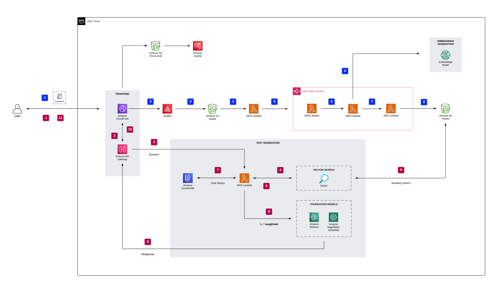
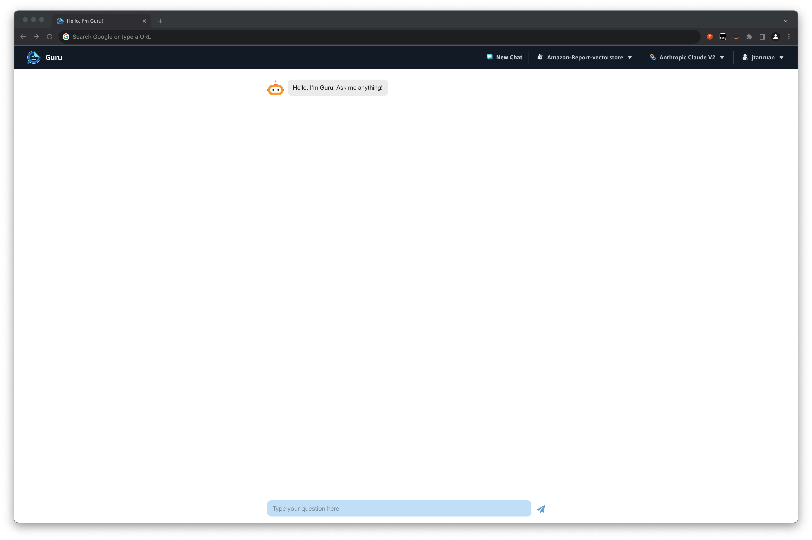
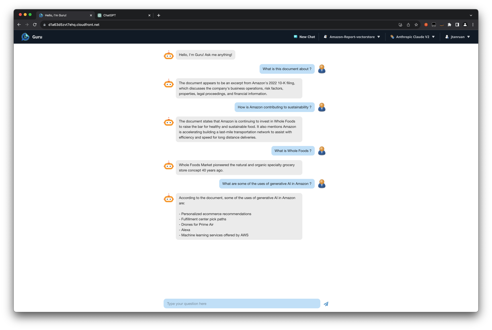
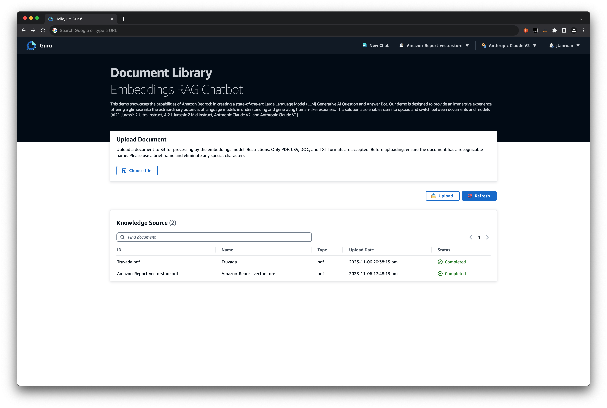

# Guru Embeddings Foundational

Author: Jin Tan Ruan<br>
Date: 04/11/2023<br>
Disclaimer: This code is provided "as is" in accordance with the repository license<br>

This demo showcases how to implement a RAG workflow with custom embeddings model and FAISS to create state-of-the-art Generative AI conversational experiences over enterprise content. The demo supports document types such as PDF, TXT, HTML, XML, JSON, RTF, PPT (Only text content), DOCX (Only text content).

This demo supports the following Amazon Bedrock and SageMaker JumpStart foundational base LLM Models.

- Anthropic - Claude V2
- Anthropic - Claude V1
- AI21 - Jurassic-2 Ultra
- AI21 - Jurassic-2 Mid
- SageMaker JumpStart Llama2 13B Chat (Optional)
- SageMaker JumpStart Falcon 40B (Optional)



## Prerequisites

1. NodeJs >= 16.10.0
2. Python3 >= 3.10
3. Docker
4. AWS CLI >= 2.0.0 configured with `default` profile using credentials from the corresponding AWS Account where this prototype needs to be deployed.

## Deployment

**The deployment time ranges from 35-40 minutes.**

The instructions assume that this solution will be deployed from a terminal running from Linux or MacOS. The instructions should also work from a POSIX terminal running from Windows, assuming that it includes the standard GNU tools.
Run the following commands at the root of the repo

```bash
    chmod +x setup-model.sh
    ./setup-model.sh
```

```bash
    chmod +x deploy.sh
    ./deploy.sh
```

## Getting started

After the deployment is successful, follow these steps to get started on using the Chatbot

1. Create a Cognito user - Run the following code to create a user within the Cognito UserPool. Refer to the output section of CloudFormation stack named **guru-chatbot**
   to get the value of the **CognitoUserPoolId** key. Be sure to replace the parameter values before running the commands.

```bash
    chmod +x create-new-user.sh
    ./create-new-user.sh USER_POOL_ID USERNAME PASSWORD
```

2. Login to the App. You will find the App CloudFront URL in the output section of CloudFormation stack named **guru-chatbot**.



3. You are all set. You are now able to interact with the ChatBot. You can choose the LLM models from the drop down menu. Choosing an LLM model will create a new Chat session.



4. Select **Upload Document**. Click **Choose file** to select document. Click on **Upload** to transfer them into S3.



## Troubleshoot

To ensure seamless processing, please refrain from uploading a new document until the current one has been fully processed. If you encounter issues with document handling, you may want to deploy the embedding model on a more robust instance such as ml.g5.12xlarge or ml.g5.24xlarge to improve performance. In the event of a document failure, attempt re-uploading the document before proceeding with further troubleshooting steps.
