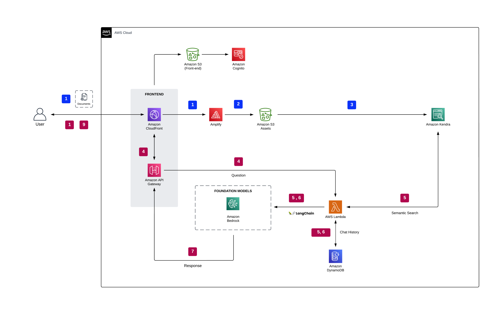
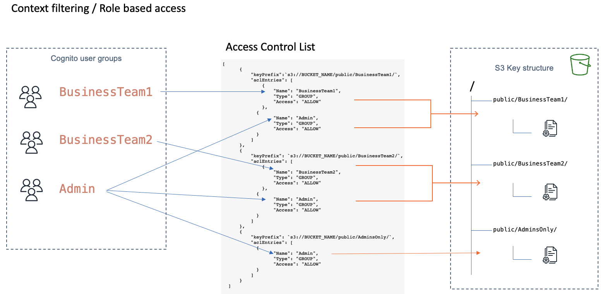

# Guru Chatbot

This demo showcases how to implement a RAG workflow by combining the capabilities of Amazon Kendra with LLMs to create state-of-the-art Generative AI conversational experiences over enterprise content. The demo supports document types such as PDF, TXT, HTML, XML, JSON, RTF, PPT (Only text content), DOCX (Only text content).

This demo supports the following Amazon Bedrock foundational base LLM Models.

- Anthropic - Claude V2
- AI21 - Jurassic-2 Ultra
- Amazon - Titan Large (Titan text G1 - Express)

### ℹ️ ***Ensure Amazon Bedrock is available in the AWS region you plan to deploy the solution in and that the LLM Model(s) is enabled.***


# Architecture



## Prerequisites

1. NodeJs >= 16.10.0
2. Python3 >= 3.10
3. Docker
4. AWS CLI >= 2.0.0 configured with `default` profile using credentials from the corresponding AWS Account where this prototype needs to be deployed.

## Deployment

**The deployment time ranges from 20-30 minutes.**

The instructions assume that this solution will be deployed from a terminal running from Linux or MacOS. The instructions should also work from a POSIX terminal running from Windows, assuming that it includes the standard GNU tools.
Run the following commands at the root of the repo

```bash
    chmod +x deploy.sh
    ./deploy.sh
```

## Getting started

After the deployment is successful, follow these steps to get started on using the Chatbot

1. Create a Cognito user - Run the following code to create a user within the Cognito UserPool. Refer to the output section of Cloudformation stack named **guru-kendra-chatbot**
   to get the value of the **CognitoUserPoolId** key. Be sure to replace the parameter values before running the commands.

```bash
    chmod +x create-new-user.sh
    ./create-new-user.sh USER_POOL_ID USERNAME PASSWORD
```

2. Login into the AWS Management console, navigate to Cognito User pool. Add the newly created user to the **Admin** Cognito User Group.

3. Login to the App. You will find the App Cloudfront URL in the output section of Cloudformation stack named **guru-kendra-chatbot**.

4. Upon logging into the app, click on **Add new documents**. Click on the **Choose files** button. Choose one or more documents. Click on **Upload** to uploaded document(s) into S3. Select the option
   **Upload to new folder**, enter **AdminsOnly** and click **Upload**. Close the dialog after the Upload is done.

5. Role based access control - The demo also provides a Access Control List template that maps Cognito user groups with S3 Key Prefixes.
   This ACL is used as a filter for search results based on the user's Group name provided by the user's JWT token forwarded by the application for the logged in user. In the following diagram, you see 3 Cognito user groups mapped to different S3 prefixes in the provided template. You are free to modify the ACL depending on your organizations security access requirements.

For more information on controlling user access to documents with tokens, refer to [documentation](https://docs.aws.amazon.com/kendra/latest/dg/create-index-access-control.html)



6. Finally, click on **Sync now** to start a Kendra Ingestion job to ingest the uploaded documents into the Kendra Index. You can monitor the Job status by clicking on the Refresh button at the bottom
   of the screen. When the Job status is **SUCCEEDED**, click on **New chat** menu option.

7. You are all set. You are now able to interact with the ChatBot. You can choose the LLM models from the drop down menu. Choosing an LLM model will create a new Chat session.
