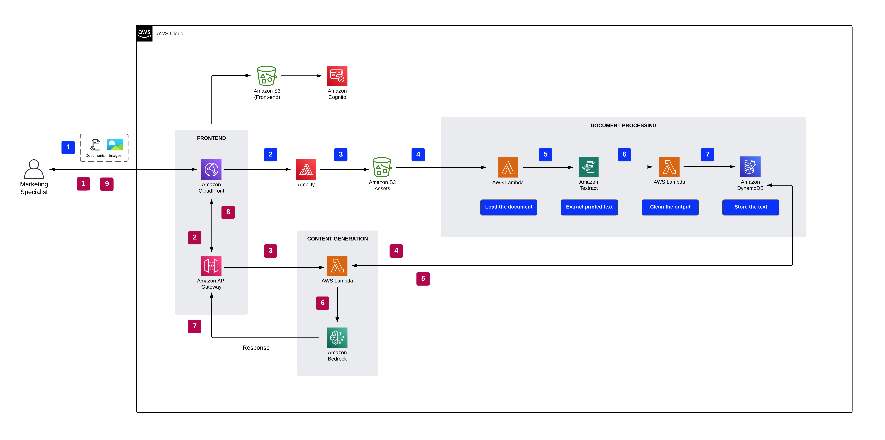
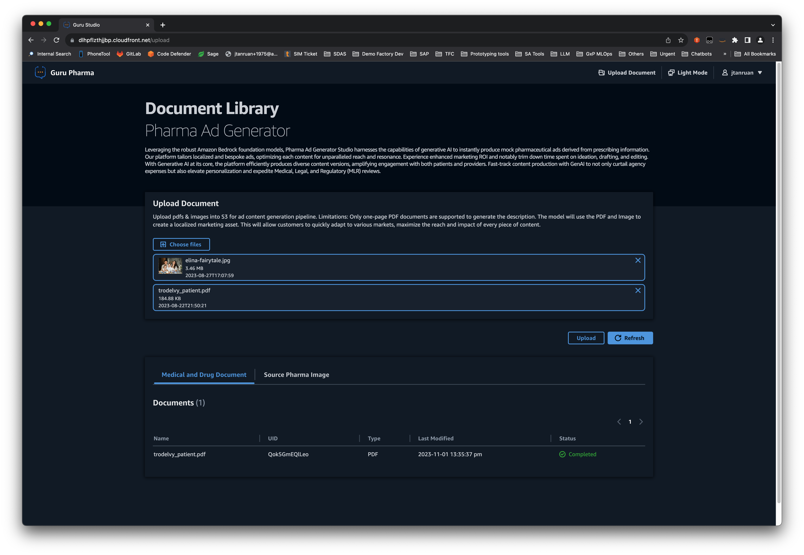
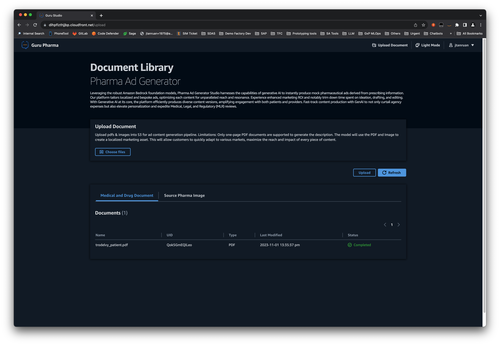
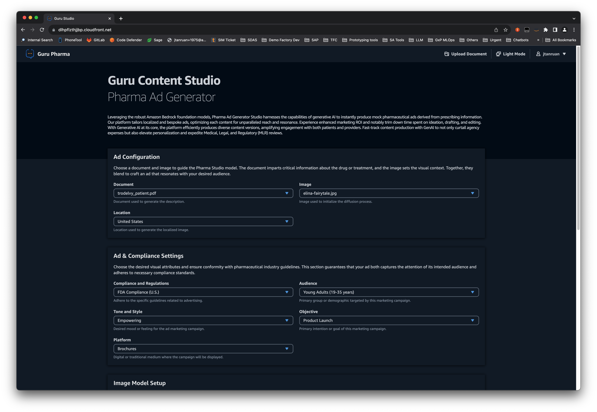
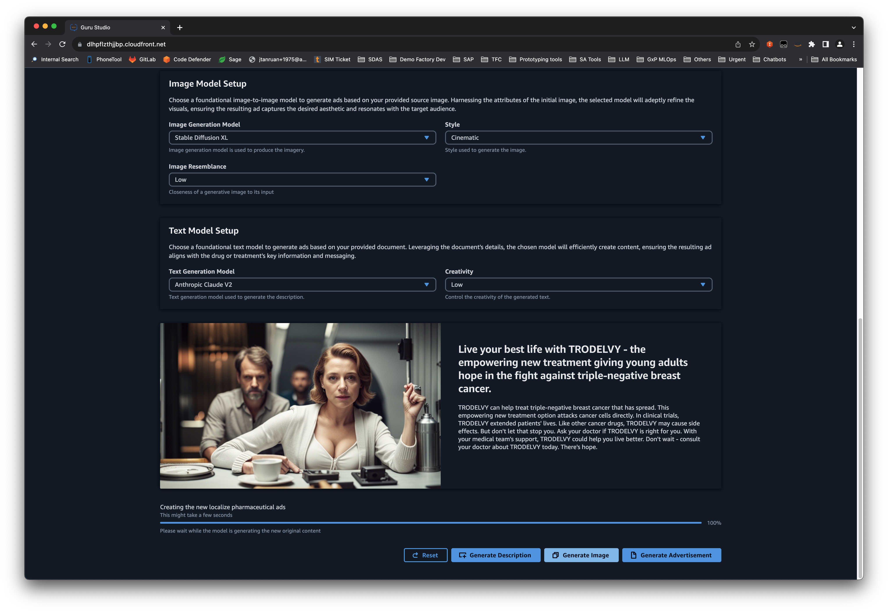

# Foundation Models Pharma Ad Generator

### Author: Jin Tan Ruan

### Date: 04/11/2023

### Disclaimer: This code is provided "as is" in accordance with the repository license

A specialized application tailored for the pharmaceutical industry. Harnessing the generative capabilities of foundational models, this tool creates convincing and compliant pharmaceutical advertisements, ensuring content adheres to industry standards and regulations.

In the architectural layout, based on their selected model and ad preferences, customers are seamlessly guided to the Amazon Bedrock foundation models. This streamlined approach ensures that new ads are generated precisely according to the desired configuration. As part of the process, documents are efficiently handled by Amazon Textract, with the resultant text securely stored in DynamoDB. A standout feature is the modular design for image and text generation, granting customers the flexibility to independently regenerate any component as required.

This demo supports the following Amazon Bedrock foundational base LLM Models.

- Anthropic - Claude V1
- Anthropic - Claude V2
- AI21 Labs - Jurassic-2 Ultra
- AI21 Labs - Jurassic-2 Mid
- Stability AI - Stable Difussion XL

# Architecture



## Prerequisites

1. NodeJs >= 16.10.0
2. Python3 >= 3.10
3. Docker
4. AWS CLI >= 2.0.0 configured with default profile using credentials from the corresponding AWS Account where this prototype needs to be deployed.

## Deployment

:information_source: **The deployment time ranges from 20-30 minutes.**

The instructions assume that this solution will be deployed from a terminal running from Linux or MacOS. The instructions should also work from a POSIX terminal running from Windows, assuming that it includes the standard GNU tools.
Run the following commands at the root of the repo

```bash
    chmod +x deploy.sh
    ./deploy.sh
```

## Getting started

After the deployment is successful, follow these steps to get started on using the Pharma Ad Generator

1. Create a Cognito user - Run the following code to create a user within the Cognito UserPool. Refer to the output section of Cloudformation stack named **guru-pharma-ad-studio**
   to get the value of the **CognitoUserPoolId** key. Be sure to replace the parameter values before running the commands.

```bash
    chmod +x create-new-user.sh
    ./create-new-user.sh USER_POOL_ID USERNAME PASSWORD
```

2. Login using the Cloudfront URL found in the **guru-pharma-ad-studio** Cloudformation stack output.

3. After logging in, select **Upload Assets**. Click **Choose files** to select documents or images. Click on **Upload** to transfer them into S3.



4. Monitor job progress by clicking the refresh button. Once the status reads **COMPLETED**, go to the main page. From there, select the document and image to craft a new advertisement.



5. In the **Ad configuration**, adjust location, style, temperature, FDA ad guidelines, step count, image intensity, image generation model, and text generation model. Then, click **Generate Advertisement**.



6. Press **Generate Description** for a new ad description. To generate a new image from the source, click **Generate Image**.


