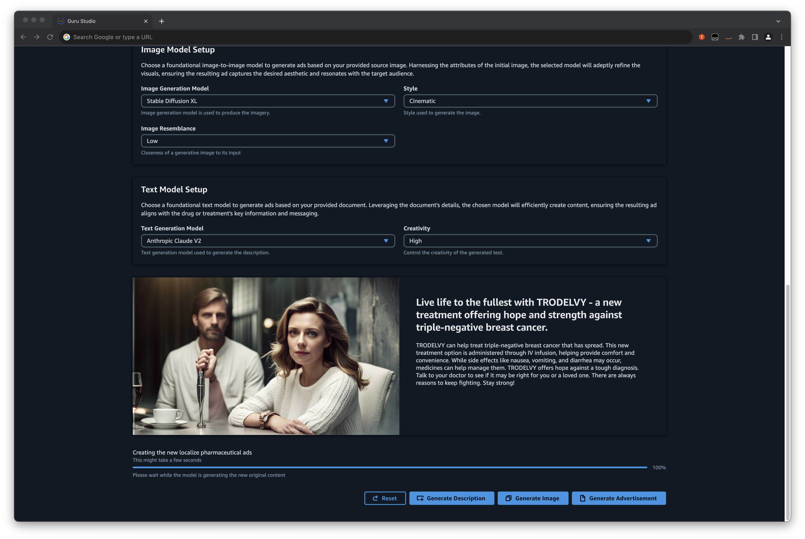

# Harnessing the power of enterprise data with generative AI: Insights from Amazon Kendra, LangChain, and large language models

This repository provides code samples for three Generative AI demos, licensed under MIT-0 license.

1. **Amazon Kendra with foundational LLM**: Utilizes the deep search capabilities of Amazon
   Kendra combined with the expansive knowledge of Large Language Models. This
   integration provides precise and context-aware answers to complex queries by drawing
   from a diverse range of sources.

2. **Embeddings model with foundational LLM**: Merges the power of embeddings—a
   technique to capture semantic meanings of words and phrases—with the vast
   knowledge base of LLMs. This synergy enables more accurate topic modeling, content
   recommendation, and semantic search capabilities.

3. **Foundation Models Pharma Ad Generator**: A specialized application tailored for the
   pharmaceutical industry. Harnessing the generative capabilities of foundational models,
   this tool creates convincing and compliant pharmaceutical advertisements, ensuring
   content adheres to industry standards and regulations

These demos can be seamlessly deployed in your AWS account, offering foundational insights and guidance on utilizing AWS services to create a state-of-the-art Large Language Model (LLM) Generative AI Question and Answer Bot and content generation.

You can deploy these demo's independent of each other. Please refer to the Readme files in each of the folders for deployment instructions.

Refer to the [blog](https://aws.amazon.com/blogs/machine-learning/harnessing-the-power-of-enterprise-data-with-generative-ai-insights-from-amazon-kendra-langchain-and-large-language-models/) post for details on how these solutions work.

## Authors

- [Jin Tan Ruan - AWSI PACE Prototyping Developer](https://www.linkedin.com/in/ztanruan)
- [Aravind Kodandaramaiah - AWSI PACE Senior Prototyping Developer](https://www.linkedin.com/in/aravindkoda)

## Troubleshoot

**Unzipped size must be smaller than 262144000 bytes (Service: AWSLambdaInternal; Status Code: 400**

1. Delete the Existing Lambda Layer Folder: Begin by removing the lambda_langchain_layer folder from your project. This action ensures that any corrupted or oversized files are cleared.
2. Recreate the Layer: After deletion, recreate the lambda layer using the deploy.sh command. This process should generate a fresh, size-compliant layer with the necessary components.
3. Clean Docker Resources: It's also crucial to ensure that no residual Docker images or containers are occupying unnecessary space. Clean all running Docker images and containers to free up space and avoid any potential conflicts.

## Reporting Bugs/Feature Requests

We welcome you to use the GitHub issue tracker to report bugs or suggest features.

When filing an issue, please check existing open, or recently closed, issues to make sure somebody else hasn't already
reported the issue. Please try to include as much information as you can. Details like these are incredibly useful:

- A reproducible test case or series of steps
- The version of our code being used
- Any modifications you've made relevant to the bug
- Anything unusual about your environment or deployment

## License

This library is licensed under the MIT-0 License. See the LICENSE file.

- [Changelog](CHANGELOG.md) of the project.
- [License](LICENSE) of the project.
- [Code of Conduct](CODE_OF_CONDUCT.md) of the project.
- [CONTRIBUTING](CONTRIBUTING.md#security-issue-notifications) for more information.
